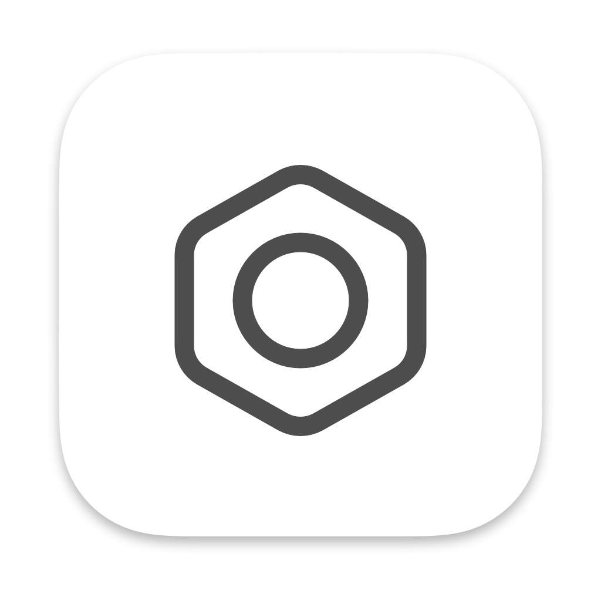
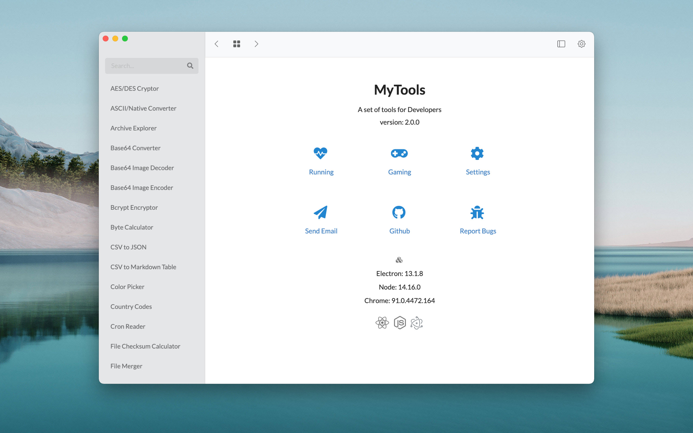

# MyTools

A desktop application based on Electron and React for daily application development.



## Tools

- AES/DES Cryptor
- Bcrypt Encryptor
- RSA Cryptor
- MD5 Encryptor
- Base64 Converter
- Hash Generator
- ASCII/Native Converter
- UTF8 Converter
- URL Encoder/Decoder
- URL Parser
- Number Converter
- XML Prettifier
- JSON Prettier
- CSV to JSON
- JSON to CSV
- CSV to Markdown Table
- HTML to Markdown
- Password Generator
- UUID Generator
- Unix Time Converter
- Cron Reader
- Color Picker
- Image Color
- SVG Optimizer
- Image Resizer
- Base64 Image Encoder
- Base64 Image Decoder
- Byte Calculator
- Text Counter
- String Utilities
- File Merger
- File Checksum Calculator
- Archive Explorer
- QRCode Generator
- SQL Formatter
- IP Converter
- Morse Code Translator
- WebSocket Tester

## CheatSheets

- TCP/UDP Ports
- HTTP Status Codes
- HTML Entities
- MIME Types
- Country Codes

and more...

## Powered by

- [Electron](https://www.electronjs.org/)
- [Electron React Boilerplate](https://github.com/electron-react-boilerplate/electron-react-boilerplate)

## Starting Development

Start the app in the `dev` environment:

```bash
yarn start
```

## Packaging for Production

To package apps for the local platform:

```bash
yarn package
```

## Building to Multiple Platforms

```bash
yarn package-all
```

## Debugging the Production Build

```bash
yarn cross-env DEBUG_PROD=true yarn build
yarn cross-env DEBUG_PROD=true yarn start
```

## Generating app icon

File: logo_icon.afphoto
Editor: Affinity Photo

Install:

```bash
npm install -g electron-icon-maker
```

then

```bash
electron-icon-maker --input=./logo.png --output=./output
```

## Suggestions

Please mail to: qiu_lin@163.com

## License

MIT
